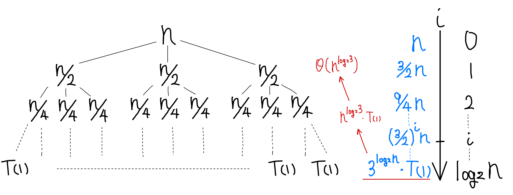
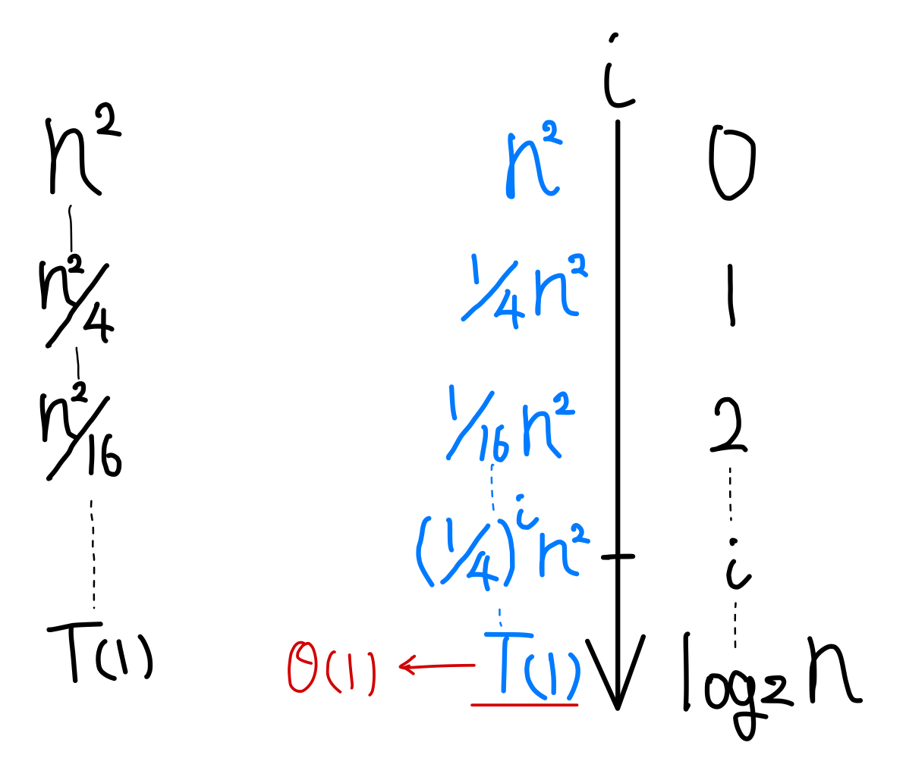
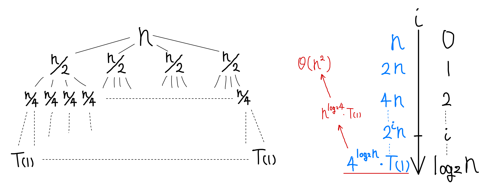
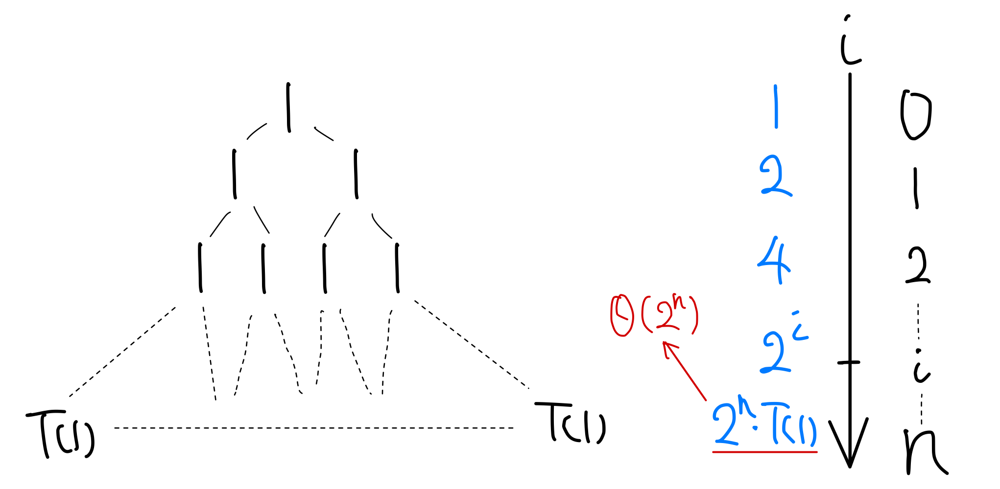
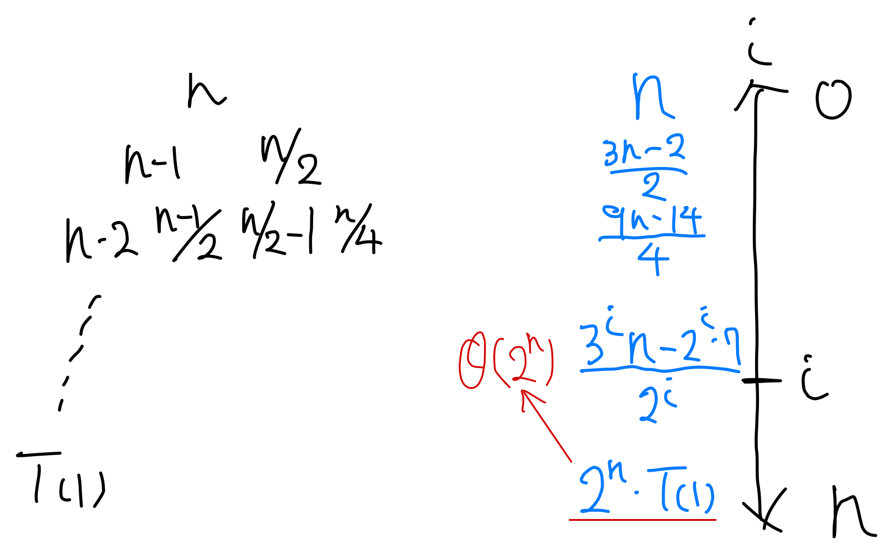

## 4.4 瀬化式を解くための再帰木法

### 4.4-1
***
> 再掃木を用いて新化式 $T(n)=3T(\left \lfloor n / 2 \right \rfloor) + n$ に対する良い漸近的上界を求めよ. 置換え法を用いて答えを検証せよ. 

$$
\begin{array}{lll}
T(n) & ≈ & \displaystyle 3T(n / 2) + n \\
& = & \displaystyle \sum_{i=0}^{\lg n - 1}(\frac{3}{2})^i n + \Theta(n^{\lg 3}) \\
& = & \displaystyle \frac{(3/2)^{\lg n}-1}{(3/2)-1}n + \Theta(n^{\lg 3}) \\
& = & \displaystyle 2n^{\lg 3} - 2n + \Theta({n^{\lg 3}}) \\
& = & \displaystyle O({n^{\lg 3}})
\end{array}
$$

$T(n) \le cn^{\lg 3}$ と仮定.

$$
\begin{array}{lll}
T(n) & \le & \displaystyle 3c(\frac{n}{2})^{\lg 3} + n  \\
     & \le & \displaystyle 3c n^{\lg 3} + n  \\
     &   = & \displaystyle O(n^{\lg 3}) \\
\end{array}
$$

よって置き換え法より検証できた.

### 4.4-2
***
> 再帰木を用いて瀬化式 $T(n)=T(n/2)+n^2$ に対する良い漸近的上界を求めよ. 置換え法を用いて答えを検証せよ.

$$
\begin{array}{lll}
T(n) & = & \displaystyle \sum_{i=0}^{\lg n - 1}(\frac{1}{4})^i n^2 + \Theta(1) \\
& = & \displaystyle \frac{(1/4)^{\lg n}-1}{(1/4)-1}n^2 + \Theta(1) \\
& = & \displaystyle \frac{4}{3}(n^2 - 1) + \Theta(1) \\
& = & \displaystyle O(n^2) \\
\end{array}
$$

$T(n) \le cn^{2}$ と仮定.

$$
\begin{array}{lll}
T(n) & \le & \displaystyle c(\frac{n}{2})^2 + n^2  \\
     & \le & \displaystyle c n^2  & \displaystyle (c \ge \frac{4}{3}) \\
     &   = & \displaystyle O(n^{\lg 3}) \\
\end{array}
$$

よって置き換え法より検証できた.

### 4.4-3
***
> 再帰木を用いて漸化式 $T(n)=4T(n/2+2)+n$ に対する良い漸近的上界を求めよ. 置換え法を用いて答えを検証せよ. 

$$
\begin{array}{lll}
T(n) & ≈ & \displaystyle 4T(n / 2) + n \\
& = & \displaystyle \sum_{i=0}^{\lg n - 1} 2^i n + \Theta(n^2) \\
& = & \displaystyle \frac{2^{\lg n}-1}{2-1}n + \Theta(n^2) \\
& = & \displaystyle n^2 - n + \Theta(n^2) \\
& = & \displaystyle O(n^2) \\
\end{array}
$$

$T(n) \le cn^{2}$ と仮定.

$$
\begin{array}{lll}
T(n) & \le & \displaystyle c(\frac{n}{2} + 2)^2 + n \\
     & \le & \displaystyle c n^2  \\
     &   = & \displaystyle O(n^{\lg 3}) \\
\end{array}
$$

よって置き換え法より検証できた.

### 4.4-4
***
> 再帰木を用いて漸化式 $T(n)=2T(n-1)+1$ に対する良い漸近的上界を求めよ. 置換え法を用いて答えを検証せよ.

$$
\begin{array}{lll}
T(n) & = & \displaystyle \sum_{i=0}^{n - 1}(2^i) + \Theta(2^n) \\
& = & \displaystyle \frac{2^n-1}{2-1} + \Theta(2^n) \\
& = & \displaystyle 2^n - 1 + \Theta(2^n) \\
& = & \displaystyle O(2^n) \\
\end{array}
$$

$T(n) \le c 2^{n}$ と仮定.

$$
\begin{array}{lll}
T(n) & \le & \displaystyle 2 c 2^{n-1} + 1 \\
     & = & \displaystyle c 2^n + 1 \\
     &   = & \displaystyle O(n^{\lg 3}) \\
\end{array}
$$

よって置き換え法より検証できた.

### 4.4-5
***
> 再帰木を用いて漸化式  $T(n)=T(n-1)+T(n/2)+n$ に対する良い漸近的上界を求めよ. 置換え法を用いて答えを検証せよ.

最長路はレベルが $n$ であり, その葉までの各レベル $i$ における総コストは $\frac{3^i n - 2^i・7}{2^i}$ より, 

$$
\begin{array}{lll}
T(n) & \le & \displaystyle  \sum_{i=0}^{n - 1}\frac{3^i n - 2^i・7}{2^i} + \Theta(2^n) \\
& \le & \displaystyle  \sum_{i=0}^{n - 1}(\frac{3}{2})^i n + \Theta(2^n) \\
& = & \displaystyle  \frac{(\frac{3}{2})^n-1}{\frac{3}{2}-1} n + \Theta(2^n) \\
& \le & \displaystyle O(n (\frac{3}{2})^n) \\
\end{array}
$$

$T(n) \le c n (\frac{3}{2})^n$ と仮定.

$$
\begin{array}{lll}
T(n) & \le & \displaystyle c (n-1) (\frac{3}{2})^{n-1} + c (\frac{n}{2}) (\frac{3}{2})^{\frac{n}{2}} + n \\
     & \le & \displaystyle c n (\frac{3}{2})^n\\
     &   = & \displaystyle O(n (\frac{3}{2})^n) \\
\end{array}
$$

よって置き換え法より検証できた.

### 4.4-6
***
> 漸化式 $T(n)=T(n/3)+T(2n/3)+cn$ の解が $\Omega(n \lg n)$ であることを再帰木を用いて論ぜよ. ただし, $c$ は定数である. 

最短路はレベルが $\log_3n$ であり, その葉までの各レベルにおける総コストは $cn$ より,

$$
\begin{array}{lll}
T(n) & \ge & \displaystyle cn(\log_3n -1) + \Theta(n) \\
& \ge & \displaystyle cn \log_3n \\
& = & \displaystyle \Omega(n \log_3n) \\
\end{array}
$$

### 4.4-7
***
> $c$ を定数とする.  $T(n)=4T(\left \lfloor n / 2 \rfloor \right) + cn$ の再帰木を描き, 解の漸近的にタイトな限界を与えよ. 置換え法を用いてこの限界を検証せよ. 

$$
\begin{array}{lll}
T(n) & ≈ & \displaystyle 4T(n / 2) + cn \\
& = & \displaystyle \sum_{i=0}^{\lg n - 1}2^i cn + \Theta(n) \\
& = & \displaystyle \frac{2^{\lg n}-1}{2-1} cn + \Theta(n) \\
& = & \displaystyle cn^2 - cn + \Theta({n}) \\
& = & \displaystyle \Theta({n^2})
\end{array}
$$

### 4.4-8
***
> $a \ge 1$ と $c > 0 $ を定数とする. $T(n) = T(n-a) + T(a) + cn$の再帰木を用いて, 解の漸近的にタイトな限界を与えよ. 

$T(0)$ は定義されていないから $T(a) = ca$ とすることにする. 根はレベルが $\frac{n}{a}$ であり, その葉までの各レベル $i$ における総コストは $cn$ より,

$$
\begin{array}{lll}
T(n) & = & \displaystyle \sum_{i=0}^{n/a}(c(n-ai) )+ \frac{n}{a} cn \\
& = & \displaystyle \Theta(n^2) \\
\end{array}
$$

### 4.4-9
***
> 再帰木を用いて漸化式 $T(n)=T(\alpha n)+T((1-\alpha)n)+cn$ の漸近的にタイトな解を求めよ. ただし,  $\alpha$ は $0 < \alpha < 1$ の範囲にある定数であり, $c > 0$ も定数である. 

最短路も最長路も特に考えなくて良い. 根はレベルが $\log_{1/\alpha}n$ であり, その葉までの各レベルにおける総コストは $cn$ より,

$$
\begin{array}{lll}
T(n) & = & \displaystyle cn(\log_{1/\alpha}n-1) + \Theta(n) \\
& = & \displaystyle \Theta(n\lg n) \\
\end{array}
$$
