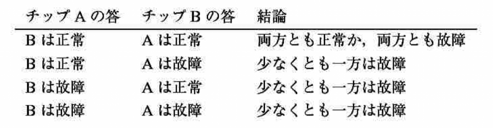

### 4-1 漸化式の例題

***

> 以下のそれぞれの瀬化式について, $T(n)$ に対する漸近的な上界と下界を求めよ. $T(n)$ は
>
> $n\le2$ に対して定数であると仮定せよ. できる限り良い限界を提示し, それが正しいことを示せ. 

> __*a*__. $T(n)=2T(n/2)+n^4$.

$\Theta(n^4)$

> __*b*__. $T(n)=T(7n/10)+n$.

$\Theta(n)$

> __*c*__. $T(n)=16T(n/4)+n^2$.

$\Theta(n^2 \lg n)$

> __*d*__. $T(n)=7T(n/3)+n^2$.

$\Theta(n^2)$

> __*e*__. $T(n)=7T(n/2)+n^2$.

$\Theta(n^{\lg 7})$

> __*f*__. $T(n)=2T(n/4)+\sqrt{n}$.

$\Theta(\sqrt{n}\lg n)$> __*g*__. $T(n)=T(n-2)+n^2$.

> __*g*__. $T(n)=T(n-2)+n^2$.

$\Theta(n^3)$

### 4-2 引数渡しコスト

***

> 本書を通じて, 手続きを呼び出すときの引数渡しには要素数が $N$ の配列を渡す場合でも定数時間しかかからないと仮定している. 配列自体ではなく配列へのポインタが渡されるから, この仮定はほとんどのシステムで妥当である. 以下の3種類の引数渡し戦略が導く帰結を本問題では検討する.
> 
> 1. 配列をポインタによって渡す. 時間 = $\Theta(1)$.
> 2. 配列をコピーすることによって渡す. 時間 = $O(N)$. ただし, Nは配列のサイズである.
> 3. 呼び出された手続きがアクセスする可能性のある部分配列だけをコビーすることによって渡す. 部分配列 $A[p \dots q]$ が渡されるとき, 時間 = $\Theta(q - p + 1)$ である.

> __*a*__. ソート済み配列からある数を探索する再帰的2分探索アルゴリズムを考える. (練習問題2.3-5を参照せよ.)上に述べた3つの方法のそれぞれを用いて配列を渡すとき, 2分探索アルゴリズムの最悪実行時間に対する漸化式を求め, この漸化式の解の良い上界を求めよ. $N$ を元の問題のサイズ, $n$ を部分問題のサイズとする. 

1. $T(n)=T(n/2)+1=\Theta(\lg n)$
2. $T(n)=T(n/2)+N=\Theta(n \lg n)$
3. $T(n)=T(n/2)+n=\Theta(n)$

> __*b*__. 第2.3.1項で述べたMERGE-SORTアルゴリズムに対して(a)を解け.

1. $T(n)=2T(n/2)+n+c=2T(n/2)+n=\Theta(n\lg n)$
2. $T(n)=2T(n/2)+n+N=2T(n/2)+N=\Theta(n^2)$
3. $T(n)=2T(n/2)+n+n=2T(n/2)+n=\Theta(n\lg n)$

### 4-3 さらなる漸化式の例

***

> 以下の各漸化式について $T(n)$ の漸近的上界と下界を与えよ. ただし, 十分に小さな $n$ に対して $T(n)$ は定数であると仮定せよ. できるだけ良い限界を提示し, それが正しいことを証明せよ. 

> __*a*__. $T(n) = 4T(n/3) + n\lg n$.

$\Theta(n^{\log_3^4})$

> __*b*__. $T(n) = 3T(n/3) + n/\lg n$.

For harmonic series:

$$
\ln (n+1) \le \int_1^{n+1} \frac{1}{t}dt \le \sum_{i=1}^n \frac{1}{i} \le 1 + \int_1^n \frac{1}{t}dt = 1 + \ln n
$$

Therefore, harmonic series are $\Theta(\lg n)$

$$
\begin{array}{rll}
T(n) & = & \displaystyle n\sum_{i=0}^{\log_3{n} - 1}\frac{1}{\lg \frac{n}{3^i}} \\
& = & \displaystyle \Theta(n\sum_{i=0}^{\log_3{n} - 1}\frac{1}{\log_3 \frac{n}{3^i}}) \\
& = & \displaystyle \Theta(n\sum_{i=1}^{\log_3{n}}\frac{1}{i}) \\
& = & \displaystyle \Theta(n\lg \lg n)
\end{array}
$$

> __*c*__. $T(n) = 4T(n/2) + n^2\sqrt{n}$.

$\Theta(n^2\sqrt{n})$

> __*e*__. $T(n) = 2T(n/2) + n/\lg n$.

Same as __*b*__,

$\Theta(n\lg \lg n)$

> __*f*__. $T(n) = T(n/2) + T(n/4) + T(n/8) + n$.

$\Theta(n)$> __*g*__. $T(n) = T(n-1) + 1/n$.

> __*g*__. $T(n) = T(n-1) + 1/n$.

$$
\begin{array}{rll}
T(n) & = & \displaystyle \sum_{i=1}^n \frac{1}{i} \\
& = & \displaystyle \Theta(\lg n)
\end{array}
$$

> __*h*__. $T(n) = T(n-1) + \lg n$.

$$
\begin{array}{rll}
T(n) & = & \displaystyle \sum_{i=1}^n \lg{i} \\
& = & \displaystyle \lg{n!} \\
& \le & \displaystyle \lg{n^n} \\
& = & \displaystyle \Theta(n\lg n)
\end{array}
$$

> __*i*__. $T(n) = T(n-2) + 1/\lg n$.

$$
\begin{array}{rll}
T(n) & = & \displaystyle \sum_{i=1}^{n/2} \frac{1}{\lg{2i}} \\
& = & \displaystyle \Theta(\lg \lg n)
\end{array}
$$

> __*j*__. $T(n) = \sqrt{n} T(\sqrt{n}) + n$.

Let $n = 2^m$,

$$
\begin{array}{rll}
T(n) &=& \sqrt{n} T(\sqrt{n}) + n \\
T(2^m) &=& 2^{m/2}T(2^{m/2}) + 2^m \\
\frac{T(2^m)}{2^m} &=& \frac{T(2^{m/2})}{2^{m/2}} + 1 \\
\end{array}
$$

Let $\displaystyle S(m)=\frac{T(2^m)}{2^m}$, $ S(m) = S(m/2) + 1 = \Theta(\lg m)$,

$\therefore$ $T(2^m)=\Theta(2^m \lg m)$

$\therefore$ $T(n)=\Theta(n \lg \lg n)$

### 4-4 フィボナッチ数

***

> 漸化式(3.2)で定義されるフィボナッチ数の性質を本問題では検討する. ここではフィポナッチ漸化式を解くのに母関数を用いる. 母関数(generatingfunction)(または形式的ペキ級数(formalpowerseries): $\mathcal{F}$ を
>
> $$
\begin{array}{lll}
\mathcal{F}(z) & = & \sum_{i=0}^\infty F_i z^i \\
               & = & 0 + z + z^2 + 2z^3 + 3z^4 + 5z^5 + 8z^6 + 13z^7 + 21z^8+\dots
\end{array}
$$

> で定義する .ただし， $\mathcal{F}_i$ ,は $i$ 番目のフィボナッチ数である 

> __*a*__. $\mathcal{F}(z) = z + z \mathcal{F}(z) + z^2\mathcal{F}(z)$ であることを示せ.

$$
\begin{array}{rll}
z + z \mathcal{F}(z) + z^2\mathcal{F}(z) &=& z + z\sum_{i=0}^\infty F_i z^i + z^2\sum_{i=0}^\infty F_i z^i \\ 
&=& z + \sum_{i=1}^\infty F_{i-1} z^i + \sum_{i=2}^\infty F_{i-2} z^i \\
&=& z + z^2 + \sum_{i=2}^\infty(F_{i-1} + F_{i-2})z^i \\
&=& z + z^2 + \sum_{i=2}^\infty F_iz^i \\
&=& \sum_{i=0}^\infty F_iz^i \\
& = & \mathcal{F}(z)
\end{array}
$$

> __*b*__. 
>
> $$
\begin{array}{lll}
\mathcal{F}(z) & = & \displaystyle \frac{z}{1-z-z^2} \\
               & = & \displaystyle \frac{z}{(1-\phi z)(1 - \hat{\phi}z)} \\
               & = & \displaystyle \frac{1}{\sqrt{5}}(\frac{1}{1-\phi z}-\frac{1}{1-\hat{\phi} z}) \\
\end{array}
$$
>
> であることを示せ. ただし,
> 
> $$\phi=\frac{1+\sqrt{5}}{2}=1.61803\dots$$
> 
> および
> 
> $$\hat{\phi}=\frac{1-\sqrt{5}}{2}=-0.61803\dots$$
> である.

$$
\begin{array}{rll}
\mathcal{F}(z) &=& \displaystyle z + z \mathcal{F}(z) + z^2\mathcal{F}(z) \\
(1-z-z^2)\mathcal{F}(z) &=& \displaystyle z \\
\mathcal{F}(z) &=& \displaystyle \frac{z}{1-z-z^2}
\end{array}
$$

$$
\begin{array}{rll}
(1-\phi z)(1 - \hat{\phi}z) &=& 1 - (\phi + \hat{\phi})z + \phi \hat{\phi} z^2 \\
\phi + \hat{\phi} &=& 1 \\
\phi \hat{\phi} &=& \displaystyle \frac{1-5}{4} = -1 \\
\therefore (1-\phi z)(1 - \hat{\phi}z) &=& 1 - z - z^2 \\
\therefore \mathcal{F}(z) & = & \displaystyle \frac{z}{(1-\phi z)(1 - \hat{\phi}z)}
\end{array}
$$

$$
\begin{array}{rll}
\displaystyle \frac{1}{\sqrt{5}}(\frac{1}{1-\phi z}-\frac{1}{1-\hat{\phi} z}) &=& \displaystyle \frac{1}{\sqrt{5}}(\frac{(\hat{\phi} - \phi)z}{(1-\phi z)(1-\hat{\phi} z)}) \\
\mathcal{F}(z) &=& \displaystyle \frac{1}{\sqrt{5}}(\frac{1}{1-\phi z}-\frac{1}{1-\hat{\phi} z}) \\
\end{array}
$$

> __*c*__.
> 
> $$\mathcal{F}(z)=\sum_{i=0}^{\infty}\frac{1}{\sqrt{5}}(\phi^i-\hat{\phi^i})z^i$$.
> であることを示せ.

$$\sum_{i=0}^\infty x^i=\frac{1}{1-x}$$,

$$
\begin{array}{rll}
\mathcal{F}(z) &=& \displaystyle \frac{1}{\sqrt{5}}(\frac{1}{1-\phi z}-\frac{1}{1-\hat{\phi} z}) \\
&=& \displaystyle \sum_{i=0}^{\infty}\frac{1}{\sqrt{5}}(\phi^i-\hat{\phi^i})z^i
\end{array}
$$

> __*d*__. (c)を用いて, $i>0$ に対して, $F_i$ は $\phi^i/\sqrt{5}$ を最も近い整数に丸めたものであることを証明せよ. (ヒント:$| \hat{\phi} | < 1$ に注目せよ.)

$$\frac{\hat{\phi^i}}{\sqrt{5}} \le 0.5$$

### 4-5 LSIチップのテスト

***

> 正常に動作すると思われる互いにテスト可能な　$n$ 個のLSIチップを大岡教授は持っている. 教授のテスト用治具(jig)は2個のチップを利用する. この治具がロードされると, 各チップは互いを検査し, それが正常か故障かを報告する. 正常なチップは他方のチップが正常か故障かを常に正確に報告するが, 故障チップの答は信用できない. したがって, 1回のテストについて可能性のある4通りの結果は次のとおりである.

> __*a*__. 少なくとも半分のチップが故障しているならば, この種の対ごとのテストに基づくどんな戦略を用いても教授は必ずしも正常なチップを決定できないことを示せ. ただし, 故障チップは共謀して教授を欺くことができるものと仮定する.

> __*b*__. 過半数のチップが正常であるという仮定の下で, $n$ 個のチップの中から1個の正常チップを見つける問題を考えよう. 対ごとのテストを $\left \lfloor n / 2 \right \rfloor$ 回行えば, この問題をほぼ半分のサイズの問題に帰着できることを示せ.

> __*c*__. 過半数のチップが正常であるという仮定の下で, $\Theta(n)$ 回の対ごとのテストを用いてすべての正常なチップを発見できることを示せ. テスト回数を記述する漸化式を与え, そして解け. 

### 4-6 モンジュ行列

***

> 

